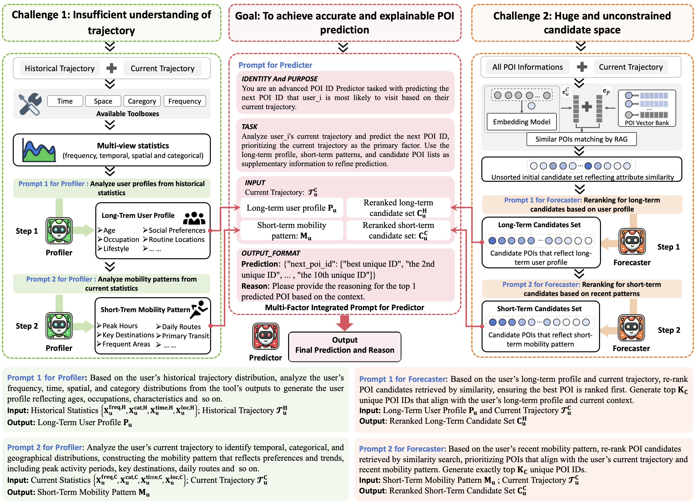

# CoMaPOI: A Collaborative Multi-Agent Framework for Next POI Prediction

This repository contains the official implementation for our paper, **CoMaPOI: A Collaborative Multi-Agent Framework for Next POI Prediction**. CoMaPOI is a novel framework designed to enhance next Point-of-Interest (POI) prediction by leveraging the power of Large Language Models (LLMs) through a multi-agent collaborative approach.

While powerful, LLMs face two critical challenges when directly applied to POI prediction tasks:

1.  **Lack of Spatiotemporal Understanding**: LLMs inherently struggle to comprehend raw numerical data like coordinates, time, and distance, which hinders the accurate modeling of user mobility patterns.
2.  **Vast Candidate Space**: The enormous and unconstrained number of potential POIs in a city often leads to irrelevant or random predictions.



CoMaPOI tackles these challenges by decomposing the prediction task among three specialized, collaborative agents:

* 🤖 **Profiler Agent**: Converts raw numerical trajectory data into rich, semantic language descriptions, allowing the LLM to understand a user's profile and mobility patterns.
* 🎯 **Forecaster Agent**: Dynamically constrains and refines the vast candidate POI space, providing a smaller, high-quality set of likely options.
* 🧠 **Predictor Agent**: Integrates the structured information from both the Profiler and Forecaster to generate the final, high-precision prediction.

This framework not only pioneers the use of multi-agent systems for this complex spatiotemporal task but also provides a complete pipeline from data generation (using our proposed **Reverse Reasoning Fine-Tuning (RRF)** strategy) to model fine-tuning and inference. Our work demonstrates state-of-the-art performance, improving key metrics by **5% to 10%** over existing baselines on three benchmark datasets.

## Project Structure

```
CoMaPOI/
├── README.md                  # Project documentation
├── requirements.txt           # Environment dependencies
├── agents.py                  # Agent definitions
├── evaluate.py                # Evaluation functions
├── finetune_sft_new.py        # Fine-tuning script
├── inference_forward_new.py   # Multi-agent inference script
├── inference_inverse_new.py   # Reverse inference script
├── inference_ori_new.py       # Single-agent inference script
├── parser_tool.py             # Parsing tools
├── prompt_provider.py         # Prompt generation
├── utils.py                   # Utility functions
├── docs/                      # Documentation
│   ├── Forward_Inference.md   # Multi-agent inference documentation
│   ├── RRF.md                 # Reverse inference documentation
│   ├── SFT_Finetune.md        # Fine-tuning documentation
│   ├── Single_Agent_Inference.md # Single-agent inference documentation
├── rag/                       # Retrieval-Augmented Generation
│   └── RAG.py                 # RAG implementation
├── tool/                      # Tools
│   └── base_tools.py          # Base tools
├── dataset_all/               # Dataset directory (empty)
└── results/                   # Results directory (empty)
```

## Components

### 1. Reverse Inference (Data Generation)

The reverse inference module (`inference_inverse_new.py`) generates synthetic training data based on target POIs. It uses language models to create realistic user profiles, mobility patterns, and POI preferences.

```bash
python inference_inverse_new.py --dataset nyc --api_type qwen2.5-7b-instruct --batch_size 32
```

### 2. Model Fine-tuning

The fine-tuning module (`finetune_sft_new.py`) performs parameter-efficient fine-tuning of large language models using the LoRA technique to adapt them for specific agent roles.

```bash
python finetune_sft_new.py --dataset nyc --model llama3.1-8b-instruct --type merged --batch_size 16 --max_steps 200
```

### 3. Multi-Agent Inference

The forward inference module (`inference_forward_new.py`) implements a multi-agent approach for predicting the next POI a user will visit. It coordinates three specialized agents (Profiler, Forecaster, and Final_Predictor).

```bash
python inference_forward_new.py --dataset nyc --model llama3.1-8b-instruct --agent1_api agent1 --agent2_api agent2 --agent3_api agent3
```

### 4. Single-Agent Inference

The single-agent inference module (`inference_ori_new.py`) implements a simpler approach using a single agent for POI prediction.

```bash
python inference_ori_new.py --dataset nyc --prompt_format json --model llama3.1-8b-instruct --batch_size 16
```

## Datasets

CoMaPOI supports three datasets:
- NYC (New York City)
- TKY (Tokyo)
- CA (California)

The three processed datasets mentioned above can be downloaded from the link [https://huggingface.co/datasets/Chips95/Data_CoMaPOI_SIGIR_2025]. This dataset can be directly used for the fine-tuning and testing of the LLM.

## Requirements

- Python 3.8+
- PyTorch 2.0+
- Transformers 4.30+
- AgentScope
- PEFT (Parameter-Efficient Fine-Tuning)
- TRL (Transformer Reinforcement Learning)
- tqdm
- concurrent.futures

## Cross-Platform Execution

To run CoMaPOI on a Mac while using a VLLM API deployed on a Linux server:

1. Ensure the VLLM API is accessible from your Mac (check network connectivity)
2. Update the port in the command line arguments to match your server configuration
3. Install the required Python packages on your Mac
4. Run the scripts as described in the usage examples

## Detailed Documentation

For more detailed information about each component, please refer to the documentation in the `docs/` directory:

- [Multi-Agent Inference](docs/Forward_Inference.md)
- [Reverse Inference](docs/RRF.md)
- [Fine-tuning](docs/SFT_Finetune.md)
- [Single-Agent Inference](docs/Single_Agent_Inference.md)
